# VoxShield: System Architecture & Data Flow Specification
*Smart India Hackathon 2026 — Problem Statement ID: 26104*

---

## 1. End-to-End System Sequence Diagram

The following Mermaid sequence diagram illustrates the complete lifecycle of an audio stream from the Android device microphone to the FastAPI backend, through the AI and RocketRide synthesis pipelines, and back to the Android UI as a deterministic policy decision.

```mermaid
sequenceDiagram
    autonumber
    actor User
    participant AndroidApp as Android Client (Jetpack Compose / WebRTCManager)
    participant WS as WebSocket Gateway (/ws/calls/{id})
    participant Buffer as Audio Buffer & VAD
    participant ML as AI Inference Engine (Deepfake, Speaker, Prosody)
    participant ASR as Whisper ASR & Intent Engine
    participant RR as RocketRide Evidence Synthesizer
    participant Risk as Risk & Policy Engine

    User->>AndroidApp: Answers Call / Starts Live Guard
    AndroidApp->>AndroidApp: AudioRecord (16kHz PCM16 Mono)
    AndroidApp->>AndroidApp: Base64 Encoding & Packaging (AudioChunk)
    AndroidApp->>WS: Send WebSocket Uplink (WebSocketManager)
    
    rect rgb(30, 41, 59)
        Note over WS,Risk: FastAPI Backend Asynchronous Processing Loop
        WS->>Buffer: Push Base64 Chunk -> Decode & Normalize
        Buffer->>Buffer: Accumulate into 3-Second Sliding Window
        Buffer->>ML: Pass Window (If VAD Speech Active)
        
        par Parallel AI Execution
            ML->>ML: Deepfake Spectral Analysis (Vocoder Artifacts)
            ML->>ML: Speaker Verification (Trusted Vault)
            ML->>ML: Prosody Jitter & Shimmer (Robotic Flatness)
        and Semantic Pipeline
            Buffer->>ASR: Transcribe Audio (OpenAI Whisper Tiny)
            ASR->>ASR: Intent Taxonomy Scan (Hinglish Financial/Coercion)
        end

        ML-->>RR: Raw Voice Evidence Vector
        ASR-->>RR: Intent Risk & Transcript
        RR->>RR: RocketRide Cross-Modal Synthesis & Confidence Scoring
        RR->>Risk: Unified Risk Score (0-100) & Reason Codes
        Risk->>Risk: Deterministic Policy Evaluation (ALLOW / VERIFY / BLOCK)
    end

    Risk-->>WS: Broadcast RiskUpdate JSON
    WS-->>AndroidApp: WebSocket Downlink (Risk Score, Voice Metrics, Decision)
    AndroidApp->>AndroidApp: Update ViewModel StateFlow
    AndroidApp->>User: Render Live UI (Visualizer Bar, Risk Meter, Challenge Question)
```

---

## 2. Audio Ingestion & Processing Pipeline

### 2.1 Edge Capture (Android Client)
*   **Source**: `MediaRecorder.AudioSource.VOICE_RECOGNITION` configured via `AudioRecord`.
*   **Format**: 16,000 Hz sample rate, mono channel, 16-bit PCM encoding.
*   **Chunking**: Captured in buffers of ~200ms (`bufferSize`), encoded to Base64 via `Base64.encodeToString(..., Base64.NO_WRAP)`, and wrapped in an `AudioChunk` payload.

### 2.2 Server-Side Ingestion (`buffer.py`, `vad.py`, `preprocessing.py`)
1.  **Decoding**: `AudioBuffer` decodes Base64 strings into `int16` numpy arrays and normalizes them to `float32` in the range $[-1.0, 1.0]$.
2.  **Sliding Windows**: Chunks are concatenated into a sliding window of length $T = 3.0$ seconds.
3.  **Voice Activity Detection (VAD)**: The Root Mean Square (RMS) energy is computed:
    $$\text{RMS} = \sqrt{\frac{1}{N} \sum_{i=1}^{N} x_i^2}$$
    If $\text{RMS} > \text{Threshold}$ (0.01), speech is confirmed, and the window proceeds to neural inference. Otherwise, processing is skipped to preserve server compute.
4.  **RMS Normalization**: Audio is scaled to a target RMS of $0.1$ to ensure uniform input scaling across different devices and distances from the microphone.

---

## 3. Multi-Signal AI Inference Pipeline

### 3.1 Spectral Deepfake Analysis (`deepfake.py`)
Evaluates high-frequency spectral flatness and vocoder mirroring artifacts using Fast Fourier Transform (FFT):
*   Computes real FFT magnitude: $X = |\text{rfft}(x)|$.
*   Compares high-frequency energy band ($4\text{kHz} - 8\text{kHz}$) against mid-frequency band ($2\text{kHz} - 4\text{kHz}$).
*   Outputs a deepfake probability score $P_{\text{synth}} \in [0.0, 1.0]$.

### 3.2 Behavioral Prosody & Rhythm (`prosody.py`)
Detects unnatural "robotic flatness" typical of neural Text-to-Speech (TTS) engines by analyzing:
1.  **Pitch Jitter**: Zero Crossing Rate (ZCR) variance. Human speech exhibits high variance; TTS outputs are often mathematically rigid.
2.  **Amplitude Shimmer**: Variance of the absolute amplitude envelope.

### 3.3 Cross-Session Speaker Verification (`speaker.py`)
Compares ongoing call embeddings against enrolled **Trusted Voice Profiles** stored in the backend vault (`profiles.py`). Cosine similarity computes whether the speaker matches the claimed identity.

### 3.4 Speech-to-Text & Intent Taxonomy (`whisper.py`, `intent.py`)
*   **ASR**: Uses **OpenAI Whisper (Tiny/Base)** to convert audio windows into text strings.
*   **Intent Engine**: Scans transcripts for multilingual (English + Hindi/Hinglish) fraud triggers across a structured taxonomy:
    *   *Financial Fraud*: `otp`, `pin`, `upi`, `bhej de`, `khata`, `paise`.
    *   *Authority Impersonation*: `police`, `cbi`, `income tax`, `rbi`.
    *   *Urgency & Coercion*: `immediately`, `abhi ke abhi`, `arrest`, `block`.

---

## 4. RocketRide Evidence Synthesis & Risk Engine

### 4.1 Cross-Modal Synthesis (`evidence.py`, `client.py`)
The `RocketRideClient` synthesizes independent signals into a cohesive explanation:
$$\text{Raw Score} = (P_{\text{synth}} \times 0.40) + (\text{Speaker Risk} \times 0.30) + (\text{Replay} \times 0.10) + (\text{Intent Boost} \times 0.20)$$

**Cross-Modal Threat Boosting**: If $P_{\text{synth}} > 0.6$ and Financial Intent is detected simultaneously, RocketRide applies an intentional threat multiplier, reflecting the extreme danger of AI-driven financial scams.

### 4.2 Deterministic Policy Engine (`policy.py`)
Translates the $0-100$ risk score into a strict operational directive:
*   $00 - 39$: `ALLOW` (Green UI, normal operation)
*   $40 - 59$: `VERIFY` (Yellow UI, prompt user caution)
*   $60 - 84$: `MFA` (Orange UI, prompt secondary verification / challenge question)
*   $85 - 100$: `BLOCK` (Red UI, auto-terminate transaction, generate critical incident)

---

## 5. Security, Privacy & Audit Trail

### 5.1 Zero Raw Audio Persistence
All audio chunks exist exclusively in server RAM during sliding window analysis and are garbage-collected immediately after inference. No raw voice recordings are saved to disk.

### 5.2 Tamper-Proof Audit Logs (`repository.py`)
Every security incident recorded in `security_db.json` is protected via cryptographic hashing:
$$\text{Audit Hash} = \text{SHA-256}(\text{JSON.stringify(Record)})`
This guarantees post-facto log integrity for enterprise and regulatory compliance.
