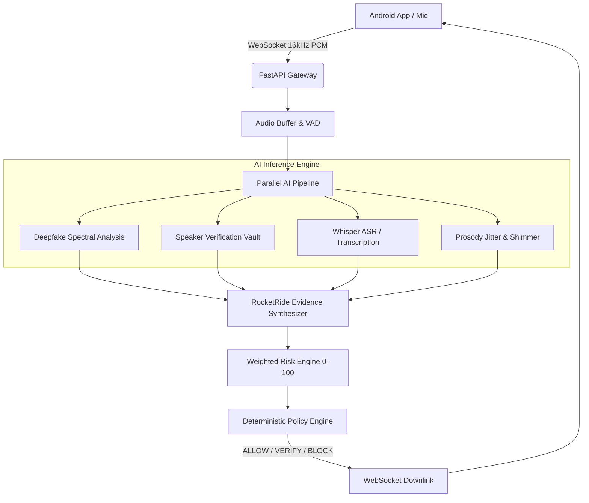

# VoxShield: Technical White Paper
**AI-Powered Real-Time Detection and Prevention of Voice Cloning & Impersonation Attacks**
*Smart India Hackathon 2026 (Problem Statement ID: 26104)*

---

## 1. Executive Summary
Recent breakthroughs in neural speech synthesis and generative AI have democratized high-fidelity voice cloning, allowing malicious actors to impersonate CXOs, government officials, and family members with only seconds of audio. Traditional telephony authentication methods (Caller ID, manual call-backs) fail against these real-time social engineering threats. 

**VoxShield** is an end-to-end security framework designed to intercept voice streams, perform multi-signal AI analysis, and compute a dynamic impersonation risk score in near real-time.

---

## 2. System Architecture
VoxShield uses a client-server architecture separating lightweight edge capture from heavy neural inference.

---

## 3. Core Technical Components

### 3.1 Multi-Layer Voice Authenticity Analysis
*   **Acoustic & Spectral Analysis (`deepfake.py`)**: Evaluates high-frequency spectral flatness and vocoder mirroring artifacts characteristic of neural Text-to-Speech (TTS).
*   **Behavioral Prosody (`prosody.py`)**: Approximates speech rhythm and pitch contours using Zero Crossing Rate (ZCR) variance and amplitude shimmers, successfully flagging unnatural "robotic flatness".
*   **Cross-Session Consistency (`speaker.py`)**: Compares ongoing call speaker embeddings against enrolled "Trusted Voice Profiles" stored securely in the local vault.

### 3.2 Real-Time Risk Scoring Engine
The system computes a weighted risk score based on multi-signal evidence:
$$\text{Final Score} = (\text{Voice} \times 0.35) + (\text{Speaker} \times 0.20) + (\text{Replay} \times 0.10) + (\text{Prosody} \times 0.10) + (\text{Intent} \times 0.15) + (\text{Context} \times 0.10)$$

*   **Cross-Modal Threat Boosting**: If a high deepfake probability correlates with a financial transfer intent (e.g., *“Send ₹25 lakh immediately”*), RocketRide applies an intentional risk multiplier.

### 3.3 Privacy & Compliance Module
*   **Zero Raw Audio Storage**: Audio streams are held strictly in-memory during 3-second sliding windows and destroyed immediately after inference.
*   **Tamper-Proof Audit Logs (`repository.py`)**: Every security incident generates a cryptographic **SHA-256 audit hash**, ensuring logs cannot be modified post-facto.

---

## 4. Multilingual & Regional Support
VoxShield incorporates a taxonomical intent engine supporting **Hinglish** (Hindi + English mix). Triggers like *"paise bhej de"* (send money) or *"abhi ke abhi"* (right now) are mapped directly to financial fraud and coercion taxonomies.

---

## 5. Conclusion
VoxShield bridges the gap in modern telephony by delivering an actionable, privacy-preserving, and explainable AI defense layer against sophisticated voice cloning attacks.
